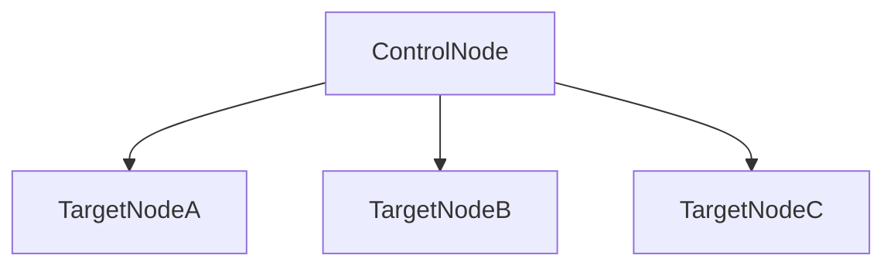

# Homelab

This repository sets up a **homelab** or self-hosted Kubernetes (k8s) instance for hosting variety of projects (web applications, automations etc).

Why? This homelab is not a new idea. The internet used to be peer-to-peer, individuals used to run ISP services, websites used to be hosted on PCs and servers in garages and basements. What was once a decentralized internet is now very centralized and federated by an oligach of large tech corporations. *The homelab is an attempt to return to the days of self-soverignety.*

## Getting Started

> [!NOTE]
> A **control node** is the host that triggers Ansible and a **target node** is the host where we that will run the homelab.

For consistency, the homelab is setup with Infrastructure as Code (IaC) thanks to [Ansible](github.com/ansible/ansible), an open-source automation tool. The intended host machine is a Raspberry Pi running Ubuntu 24.



The way Ansibe works is that:

1. the **control node** gets a set of instructions
2. the **control node** connects to one or more **target nodes** (usually with SSH)
3. the **control node** executes the instructions on the **target nodes**

### Pre-requisites

**General** pre-requisites:

- access to personal network (wifi)
- a control node (i.e. a computer)
- a target node (i.e. a secondary computer, Raspberry Pi)

**Control node** pre-requisites:

- Python3
- Private and Public Key for passwordless SSH access

**Target node** pre-requisites:

- Ubuntu 24
- Python3
- Openssh-server
- Include the **control node**'s Public Key in the **target node**'s `~/.ssh/authorized_keys` for passwordless SSH access

### Configuration

You will need to configure two files. Both are gitignored so your real values are never committed:

```bash
cp inventory.example.yaml inventory.yaml
cp vars/main.example.yaml vars/main.yaml
```

1. `inventory.yaml` — define your target nodes (hosts, SSH details). See [inventory.example.yaml](./inventory.example.yaml) for the structure.
2. `vars/main.yaml` — set your site-specific values (MetalLB IP pool, versions, addons). See [vars/main.example.yaml](./vars/main.example.yaml) for all options.

### Installation

> [!TIP]
> The configuration happens on the **control node**.

Install depenendcies:

```bash
python3 -m venv .venv && source .venv/bin/activate
python3 -m pip install -r requirements.txt
```

Create the homelab:

```bash
ansible-playbook -i inventory.yaml playbooks/homelab.yaml
```

What the command does:
- `ansible-playbook`: calls the ansible CLI
- `-i inventory.yaml`: the inventory of **target nodes**
- `playbooks/homelab.yaml`: the playbook for installing the homelab
