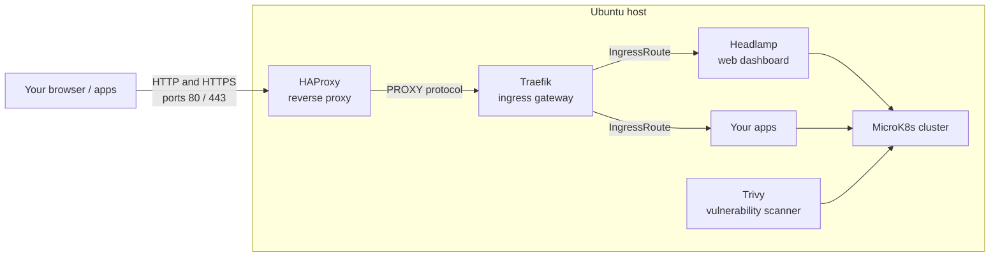

# Homelab

A self-hosted homelab that provisions a single Ubuntu host into a Kubernetes cluster with a web dashboard, an ingress gateway and a firewall-tightened reverse proxy — all driven by Ansible.

## How it works

One command provisions the whole stack. Ansible connects to your host and layers each component on top of the last: base system setup, a MicroK8s cluster, the Traefik ingress, the Headlamp + Trivy dashboards, and finally an HAProxy reverse proxy that is the only public entry point.



Every layer is an [Ansible role](#components). Installs and uninstalls live in two separate playbooks, and each role is targeted with `--tags`. See [docs/architecture.md](docs/architecture.md) for the full breakdown.

## Components

| Layer | Role | What it does |
| --- | --- | --- |
| Base | [base](ansible/roles/base/README.md) | Preflight checks, `homelab` group/user, home directory |
| Kubernetes | [k8s_core](ansible/roles/k8s_core/README.md) | Kubectl + Helm CLI tools, MicroK8s cluster with hardened addons |
| Networking | [k8s_extension_traefik](ansible/roles/k8s_extension_traefik/README.md) | Traefik ingress gateway, dashboard, rate limiting, HTTPS |
| Monitoring | [k8s_extension_headlamp](ansible/roles/k8s_extension_headlamp/README.md) | Headlamp dashboard with Trivy vulnerability scanning |
| Reverse proxy | [reverse_proxy](ansible/roles/reverse_proxy/README.md), [podman](ansible/roles/podman/README.md) | HAProxy container as the only public entry point, locked down with iptables |

## Getting Started

### Pre-requisites

- Python 3.12+ on your control machine
- A Linux host running **Ubuntu 20.04 LTS**
  - 2 CPU minimum
  - 2 GB RAM minimum
  - An IP address or DNS name Ansible can reach

### Install dependencies

```bash
# setup python env
python3 -m venv .venv
source .venv/bin/activate

# install deps
python3 -m pip install -r requirements.txt
```

### Configure the inventory

> [!IMPORTANT]
> The **controller** host group is mandatory although other groups are optional.

```bash
cp ansible/inventory/main.example.yaml ansible/inventory/main.yaml
```

Edit `ansible/inventory/main.yaml` and set the IP address (or url), `ansible_port`, `ansible_user` and `ansible_ssh_private_key_file` for your host. Remove host groups that you do not intend to use.

> [!NOTE]
> Adding a **worker** host group will set up additional worker nodes to your cluster.

### Configure secrets

```bash
cp .env.example .env
```

Fill in the REQUIRED values, then apply them to your shell:

```bash
export $(cat .env | tr '\n' ' ')
```

| Variable | Required | Purpose |
| --- | --- | --- |
| `HOMELAB_ADMIN_USERNAME` | yes | Admin username used by dashboard login |
| `HOMELAB_ADMIN_PASSWORD` | yes | Admin password used by dashboard login |
| `HOMELAB_DOMAIN_URL` | no | Public domain served by the homelab |
| `HOMELAB_DOMAIN_HTTPS_EMAIL` | no | Email for Let's Encrypt certificates |

The `ansible/config.yaml` holds every non-secret setting and has working defaults, so it needs no editing to get started. See [docs/intro.md](docs/intro.md) for the full reference (including `HOMELAB_DOMAIN_HTTPS_ENABLED` and `HOMELAB_SECURITY_TRIVY_ENABLED`).

## Usage

Install homelab on the target host:

```bash
ansible-playbook -i ansible/inventory/main.yaml ansible/homelab.yaml
```

Uninstall homelab on the target host:

```bash
ansible-playbook -i ansible/inventory/main.yaml ansible/homelab_uninstall.yaml --tags uninstall
```

That removes the reverse proxy, the cluster and the cluster tooling. The Helm releases (Headlamp, Trivy, Traefik) are opt-in and need a live cluster, so remove them first:

```bash
ansible-playbook -i ansible/inventory/main.yaml ansible/homelab_uninstall.yaml --tags monitor
ansible-playbook -i ansible/inventory/main.yaml ansible/homelab_uninstall.yaml --tags networking
```

## Documentation

- [docs/README.md](docs/README.md) — documentation index
- [docs/intro.md](docs/intro.md) — step-by-step getting started and usage in depth
- [docs/architecture.md](docs/architecture.md) — how the stack is wired together
- [CONTRIBUTING.md](CONTRIBUTING.md) — contributing guide
- [docs/examples/demo.yaml](docs/examples/demo.yaml) — example app you can deploy after install
