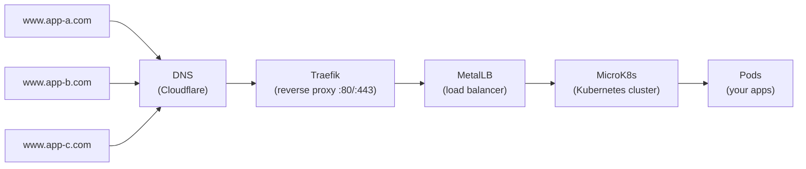

# Homelab

This repository provisions a self-hosted Kubernetes cluster for running web applications, automations, and other services on your own hardware.

The internet was once a peer-to-peer network — individuals ran ISPs, websites lived on PCs in garages, and infrastructure was decentralized. Today, most of that is concentrated behind a handful of large tech corporations. The homelab is a step back toward self-sovereignty: owning your infrastructure, your data, and your stack.



## Tech Stack

| Component | Role | Purpose |
|---|---|---|
| [Ansible](https://github.com/ansible/ansible) | Automation | Infrastructure as Code — provisions the cluster from a control node |
| [MicroK8s](https://canonical.com/microk8s) | Compute | Lightweight Kubernetes distribution for edge and IoT |
| [Helm](https://helm.sh) | Package Management | Kubernetes package manager — installs and manages cluster extensions |
| [MetalLB](https://metallb.universe.tf) | Load Balancing | Exposes services on your local network with real IP addresses |
| [Traefik](https://traefik.io) | Reverse Proxy / Ingress | Routes external traffic (HTTP/HTTPS) to the right services |
| [Cert Manager](https://cert-manager.io) | TLS | Automates TLS certificate issuance and renewal (Let's Encrypt) |
| [Headlamp](https://headlamp.dev) | Dashboard | Web UI for managing and inspecting the Kubernetes cluster |

For a deeper explanation of how these components connect, see [Architecture](docs/architecture.md).

## Getting Started

> [!NOTE]
> A **control node** is the machine that runs Ansible. A **target node** is the machine where the homelab runs.

### Pre-requisites

**General:**

- access to your local network (Wi-Fi or Ethernet)
- a control node (any computer with Python 3 and SSH)
- a target node (e.g. a Raspberry Pi running Ubuntu 24)

**Control node:**

- Python 3
- SSH key pair for passwordless access to the target node

**Target node:**

- Ubuntu 24
- Python 3
- `openssh-server` installed and running
- the control node's public key in `~/.ssh/authorized_keys`

### Configuration

Two files control your setup. Both are gitignored so real values are never committed:

```bash
cp inventory.example.yaml inventory/main.yaml
cp vars/main.example.yaml vars/main.yaml
```

1. **`inventory/main.yaml`** — target node definitions (hosts, SSH details). See [inventory.example.yaml](./inventory.example.yaml) for the structure.
2. **`vars/main.yaml`** — site-specific values (MetalLB IP pool, Traefik domain, component versions). See [vars/main.example.yaml](./vars/main.example.yaml) for all options.

### Installation

> [!TIP]
> Run these commands on the **control node**.

Install dependencies:

```bash
python3 -m venv .venv && source .venv/bin/activate
python3 -m pip install -r requirements.txt
```

Create the homelab:

```bash
ansible-playbook -i inventory/main.yaml playbooks/homelab.yaml
```

| Flag | Purpose |
|---|---|
| `ansible-playbook` | the Ansible CLI entry point |
| `-i inventory/main.yaml` | the inventory of target nodes |
| `playbooks/homelab.yaml` | the playbook that orchestrates the installation |

To tear down the homelab, run with the uninstall flag:

```bash
ansible-playbook -i inventory/main.yaml playbooks/homelab.yaml -e "uninstall=true"
```

## Further Reading

- [Architecture](docs/architecture.md) — how the components fit together
- [Container Orchestration](docs/container-orchestration.md) — Kubernetes and MicroK8s
- [Load Balancing](docs/load-balancing.md) — MetalLB and IP allocation
- [Reverse Proxy](docs/reverse-proxy.md) — Traefik and traffic routing
