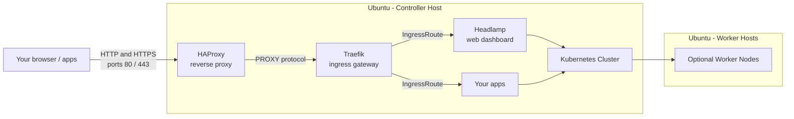

# Homelab

A self-hosted homelab that provisions an Ubuntu host into a Kubernetes cluster with an ingress gateway, a firewall-tightened reverse proxy and a web dashboard — all driven by Ansible.

## How it works

One command provisions the whole stack. Ansible connects to your host and layers each component on top of the last: base system setup, a MicroK8s cluster, the Traefik ingress, the Headlamp + Trivy dashboards, and finally an HAProxy reverse proxy that is the only public entry point.


```mermaid
flowchart LR
    Client[Your browser / apps] -->|HTTP and HTTPS<br/>ports 80 / 443| HAProxy[HAProxy<br/>reverse proxy]

    subgraph controller[Ubuntu - Controller Host]
        HAProxy -->|PROXY protocol| Traefik[Traefik<br/>ingress gateway]
        Traefik -->|IngressRoute| Headlamp[Headlamp<br/>web dashboard]
        Traefik -->|IngressRoute| Apps[Your apps]
        Headlamp --> MicroK8s[Kubernetes Cluster]
        Apps --> MicroK8s
    end
    
    subgraph worker[Ubuntu - Worker Hosts]
        MicroK8s --> MicroK8sWorker[Optional Worker Nodes]
    end
```

Every layer is an [Ansible role](#components). Installs and uninstalls live in two separate playbooks, and each role is targeted with `--tags`. See [docs/architecture.md](docs/architecture.md) for the full breakdown.

## Components

| Layer | Role | What it does |
| --- | --- | --- |
| Base | [base](ansible/roles/base/README.md) | Preflight checks, `homelab` group/user, home directory, generated summary readme |
| Kubernetes | [k8s_core](ansible/roles/k8s_core/README.md) | Kubectl + Helm CLI tools, MicroK8s cluster with hardened addons, Worker nodes for more compute |
| Ingress | [k8s_extension_traefik](ansible/roles/k8s_extension_traefik/README.md) | Traefik ingress gateway, dashboard, rate limiting, HTTPS |
| Monitoring | [k8s_extension_headlamp](ansible/roles/k8s_extension_headlamp/README.md) | Headlamp dashboard with Trivy vulnerability scanning |
| Reverse proxy | [reverse_proxy](ansible/roles/reverse_proxy/README.md) | HAProxy container as the only public entry point, locked down with iptables |

## Getting Started

### Pre-requisites

- Python 3.12+ on your control machine
- A Linux host running **Ubuntu 20.04 LTS**
  - 2 CPU minimum
  - 2 GB RAM minimum
  - An IP address or DNS name Ansible can reach

### Install dependencies

```bash
# setup python env
python3 -m venv .venv
source .venv/bin/activate

# install deps
python3 -m pip install -r requirements.txt
```

### Configure the inventory

Create a `ansible/inventory/main.yaml` file that defines the inventory that Ansible will use when running playbooks. Use the [`ansible/inventory/main.example.yaml`](ansible/inventory/main.example.yaml) file as an example for how the homelab expects the inventory hosts to look:

```bash
cp ansible/inventory/main.example.yaml ansible/inventory/main.yaml
```

Ansible uses the inventory to define and group hosts (i.e. servers, computers, Raspberry Pis). A host is defined with an IP address (or domain), a port, a username and credential (password or SSH key). Our homelab relies on two types of hosts:

- `controller` - [REQUIRED] A **single** controller node that will host the Kubernetes cluster.
- `workers` - [OPTIONAL] One or more worker nodes that add compute to the `controller` host (i.e. the Kubernetes cluster).

### Configure secrets

```bash
cp .env.example .env
```

Fill in the REQUIRED values, then apply them to your shell:

```bash
export $(cat .env | tr '\n' ' ')
```

| Variable | Required | Purpose |
| --- | --- | --- |
| `HOMELAB_ADMIN_USERNAME` | yes | Admin username used by dashboard login |
| `HOMELAB_ADMIN_PASSWORD` | yes | Admin password used by dashboard login |
| `HOMELAB_DOMAIN_URL` | no | Public domain served by the homelab |
| `HOMELAB_DOMAIN_HTTPS_EMAIL` | no | Email for Let's Encrypt certificates |

The `ansible/config.yaml` holds every non-secret setting and has working defaults, so it needs no editing to get started. See [docs/intro.md](docs/intro.md) for the full reference (including `HOMELAB_DOMAIN_HTTPS_ENABLED` and `HOMELAB_SECURITY_TRIVY_ENABLED`).

## Usage

Install homelab on the target host:

```bash
ansible-playbook -i ansible/inventory/main.yaml ansible/homelab.yaml
```

The last play writes a summary of what it built to `~/homelab/README.md` on the host: the dashboard URLs, the versions actually deployed, the cluster's nodes and ingress routes, and how to reach the kubeconfig. Regenerate it on its own with `--tags summary`; anything you write in its notes section survives re-runs.

> [!TIP]
> You can use `--tags` to target specific installations (or uninstallations). To see the supported tags, run `ansible-playbook -i ansible/inventory/main.yaml ansible/homelab.yaml --list-tags`.

Uninstall homelab on the target host:

```bash
ansible-playbook -i ansible/inventory/main.yaml ansible/homelab_uninstall.yaml --tags uninstall
```

That removes the reverse proxy, the cluster and the cluster tooling. The Helm releases (Headlamp, Trivy, Traefik) are opt-in and need a live cluster, so remove them first:

```bash
ansible-playbook -i ansible/inventory/main.yaml ansible/homelab_uninstall.yaml --tags monitor
ansible-playbook -i ansible/inventory/main.yaml ansible/homelab_uninstall.yaml --tags ingress
```

## Documentation

- [docs/README.md](docs/README.md) — documentation index
- [docs/intro.md](docs/intro.md) — step-by-step getting started and usage in depth
- [docs/architecture.md](docs/architecture.md) — how the stack is wired together
- [CONTRIBUTING.md](CONTRIBUTING.md) — contributing guide
- [docs/examples/demo.yaml](docs/examples/demo.yaml) — example app you can deploy after install
