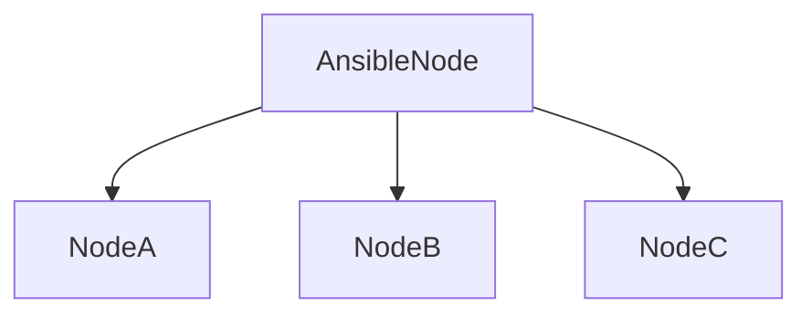

# Ansible

[Ansible](github.com/ansible/ansible) is an open-source tool that lets you automate, with SSH, the configuration of servers with human-readble YAML files in a Infrastructure as Code (IaC) style.

This Ansible setup is designed to prepare a server(s) for web hosting by installing the following components:

- [ ] `podman` to run containers
- [ ] `dynamic-dns` for dynamic DNS updates
- [ ] `microk8s` for container orchestration
  - [ ] `cert-manager` in the microk8s instance for SSL certificate management
  - [ ] `ingress-nginx` in the microk8s instance for reverse proxying
