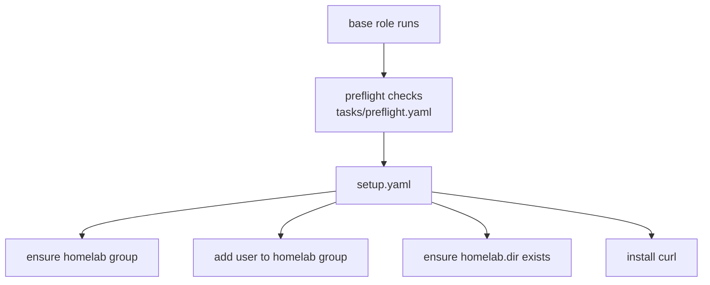

# Role: base

## What

Bootstraps the target host before anything else is installed: runs the mandatory preflight checks, creates the shared `homelab` group, adds the connecting user to it, creates the homelab directory and installs basic system tools (`curl`).

## Why

Every other layer assumes the homelab directory and group exist, and most roles require admin credentials, a valid domain, and Ubuntu. The `base` role is where those preconditions are validated and cheap host prep happens, so downstream failures are caught early and nothing else re-implements them.

## How

`main.yaml` is a thin entry point:



Preflight always runs (tagged `always`), so even targeted runs like `--tags traefik` still gate on Ubuntu, admin credentials, a valid domain URL and a valid HTTPS email.

The playbook only invokes this role when `uninstall` is false:

```yaml
- name: Basic
  when: not (uninstall | bool)
  ansible.builtin.include_role:
    name: base
```

## Variables

None (role-local). It consumes `homelab.dir` from `config.yaml`.

| Variable | Source | Description |
| --- | --- | --- |
| `homelab.dir` | `config.yaml` (default `~/homelab`) | Directory created and group-owned by the homelab group. |

## Dependencies

- `tasks/preflight.yaml` — shared assertions (Ubuntu, admin credentials, domain URL, HTTPS email).

## Tags

- `base`

Run it alone with:

```bash
ansible-playbook -i ansible/inventory/main.yaml ansible/homelab.yaml --tags base
```

## Uninstall

None. The base layer is the foundation the whole stack assumes; it has no `teardown.yaml` and is never run with the `uninstall` flag. To reclaim the host, wipe it or reinstall the OS.
