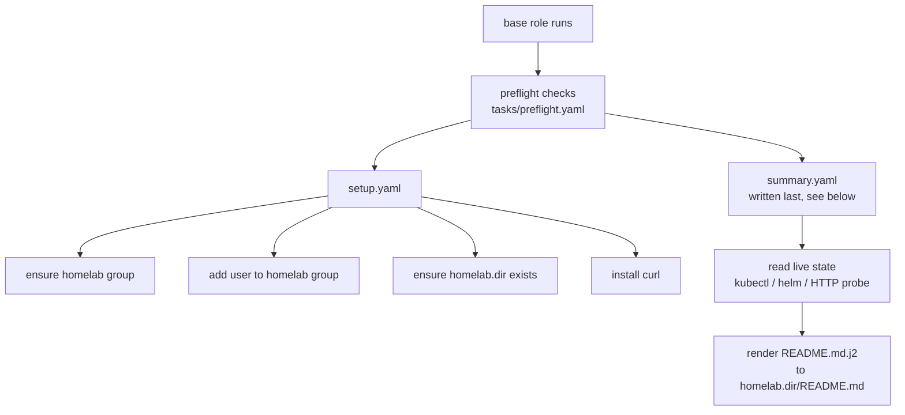

# Role: base

## What

Bootstraps the target host before anything else is installed: runs the mandatory preflight checks, creates the shared `homelab` group, adds the connecting user to it, creates the homelab directory and installs basic system tools.

After the rest of the stack is up, it also writes `~/homelab/README.md` — a generated summary of the running cluster with the dashboard URLs, live versions and a hand-written notes section.

## Why

Every other layer assumes the homelab directory and group exist, and most roles require admin credentials, a valid domain, and Ubuntu. The `base` role is where those preconditions are validated and cheap host prep happens, so downstream failures are caught early and nothing else re-implements them.

The summary exists because a fresh install otherwise leaves the operator guessing: the dashboards are behind auth on a port only reachable through a proxy chain, and the versions actually deployed are whatever Helm last resolved, not what the config asked for. The file answers "where do I click, and what am I actually running" without a `kubectl` invocation.

## How

`main.yaml` is a thin entry point:


```mermaid
flowchart TD
    role[base role runs] --> preflight[preflight checks<br/>tasks/preflight.yaml]
    preflight --> setup[setup.yaml]
    setup --> group[ensure homelab group]
    setup --> user[add user to homelab group]
    setup --> dir[ensure homelab.dir exists]
    setup --> tools[install curl]
    preflight --> summary[summary.yaml<br/>written last, see below]
    summary --> query[read live state<br/>kubectl / helm / HTTP probe]
    query --> render[render README.md.j2<br/>to homelab.dir/README.md]
```

Preflight always runs (tagged `always`), so even targeted runs like `--tags traefik` still gate on Ubuntu, admin credentials, a valid domain URL and a valid HTTPS email.

### The summary

`summary.yaml` is not part of `main.yaml`. It is reached only through `tasks_from` from the last play of `ansible/homelab.yaml`, and it reads the cluster **live** rather than from the other roles' variables. That is deliberate: role vars only exist while their own role is executing, so by the time a final play runs there is nothing left to read but the cluster itself.

| Value | Source |
| --- | --- |
| Kubernetes version, context | `kubectl version -o json`, `kubectl config current-context` |
| Chart and app versions, release status | `helm list --all-namespaces -o json` |
| Nodes, roles, addresses, readiness | `kubectl get nodes -o json` |
| Paths, hosts, middlewares, cert resolvers actually served | `kubectl get ingressroute.traefik.io -A -o json` |
| Whether each endpoint answers | `uri` probe of the reported URLs |
| Origin and scheme | `homelab.domain.*`, falling back to the controller host |

Every query is non-fatal, so a partial install still produces a file with the unreachable parts marked rather than failing the run. The probes deliberately send no credentials: a `401` is the success signal, it proves the basic-auth middleware is in place, and it keeps the admin password out of the playbook log. The admin password is never written to the file.

Hand-written notes survive re-runs. Anything between the `notes:start` and `notes:end` markers is lifted out of the previous render and re-emitted; `blockinfile` cannot do this, because it rewrites the region between its markers and the template replaces the file wholesale.

Regenerate without touching anything else:

```bash
ansible-playbook -i ansible/inventory/main.yaml ansible/homelab.yaml --tags summary
```

## Variables

| Variable | Source | Description |
| --- | --- | --- |
| `homelab.dir` | `config.yaml` (default `~/homelab`) | Directory created and group-owned by the homelab group, and the parent of the generated `README.md`. |
| `homelab.domain.*` | `config.yaml` | Decides the origin and whether the reported URLs are `https` or `http`. |
| `homelab.security.trivy.enabled` | `config.yaml` | Reported as the vulnerability-scanning status. |

## Dependencies

- `tasks/preflight.yaml` — shared assertions (Ubuntu, admin credentials, domain URL, HTTPS email).
- A running cluster, kubectl and Helm — only for `summary.yaml`, which the last play of `homelab.yaml` runs after every other role.

## Tags

- `base`
- `summary` — regenerate the summary readme on its own

Run them alone with:

```bash
ansible-playbook -i ansible/inventory/main.yaml ansible/homelab.yaml --tags base
ansible-playbook -i ansible/inventory/main.yaml ansible/homelab.yaml --tags summary
```

## Uninstall

`teardown.yaml` removes the generated `README.md` and nothing else. The `homelab` group, the user's membership in it and `homelab.dir` all stay, because the other teardowns write into that directory and a reinstall expects the foundation to still be there. Reclaiming those is out of scope for this role.

It runs **first** in `ansible/homelab_uninstall.yaml`, tagged `uninstall` and `summary`. That position is the reverse of the install order — the summary is the last artifact written, so it is the first removed, and an interrupted teardown then never leaves a README describing a half-removed stack. To drop just the summary:

```bash
ansible-playbook -i ansible/inventory/main.yaml ansible/homelab_uninstall.yaml --tags summary
```
