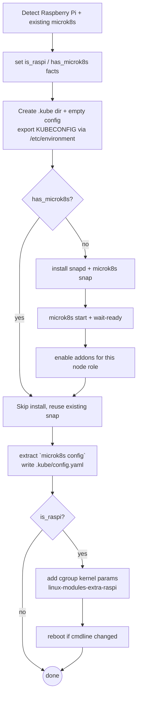

# Role: k8s_core

## What

Installs and configures:

1. Kubernetes cluster — MicroK8s via Snap — enables its hardened addons, writes a KubeConfig the operator (and future roles) can use, and applies the kernel settings Raspberry Pi hosts need.
2. `kubectl` CLI on the host via Snap, pinned to the Kubernetes version configured in `config.yaml` (`homelab.k8s.version`).
3. `helm` CLI on the host via Snap (channel `latest/stable`), so Helm-based extension roles (Traefik, Headlamp, Trivy) can manage their chart releases.

This role also has a [`worker.yaml` task](tasks/worker.yaml) that adds worker nodes to the cluster.

## Why

Kubernetes cluster - MicroK8s is the cluster substrate everything else runs on: Traefik, Headlamp, Trivy and user apps are all deployed into it. This role makes the cluster repeatable (snap channel locked to `homelab.k8s.version`) and secure (CIS hardening + RBAC addons on by default).

`kubectl` cli - Kubectl is the operator's interface to the MicroK8s cluster. Installing it means that we have an interoperable way to operate the cluster instead of relying on the `kubectl` that comes with every flavor of Kubernetes (i.e. `microk8s kubectl`).

`helm` cli - All Kubernetes extensions in this homelab are installed as Helm charts. Installing Helm and using it to manage extensions keeps the dependency explicit and interoperable rather than relying on the extension framework that comes with every flavor of Kubernetes (i.e. `microk8s enable trivy`).

## How



Environments it handles specially:

- **Existing MicroK8s** — if the snap is already installed, install steps are skipped; the KubeConfig is still (re)written from the running cluster.
- **Node roles** — each addon in `k8s_core_addons` carries a flag per inventory group (`controllers`, `workers`). On a controller the host is tagged `k8s_core_node_role: controllers` and only the addons with `controllers: true` are enabled; every other host is tagged `workers` and gets the `workers: true` addons. Both flags are required on every entry — a missing flag is a templating error, not a silent skip. `hostpath-storage` is controller-only because only a single node may run the hostpath provisioner.
- **Raspberry Pi** — installs `linux-modules-extra-raspi` (Ubuntu < 24.04) and appends `cgroup_enable=memory cgroup_memory=1` to the boot cmdline (`/boot/firmware/cmdline.txt` / `nobtcmd.txt`), rebooting once if the parameters changed. See the [MicroK8s Raspberry Pi guide](https://canonical.com/microk8s/docs/install-raspberry-pi).

## Variables

| Variable | Default | Description |
| --- | --- | --- |
| `homelab.k8s.version` | `1.36` (from `config.yaml`) | Snap channel for MicroK8s and `kubectl` cli. |
| `homelab.dir` | `~/homelab` (from `config.yaml`) | Parent of `~/.kube`. |
| `k8s_core_addons` | `cis-hardening`, `dns`, `hostpath-storage`, `rbac` | MicroK8s addons enabled on first install. Each entry is `{name, controllers, workers}`; the flag matching the host's node role decides whether it is enabled there. |
| `k8s_core_helm_version` | `latest/stable` | Snap channel for Helm. |

## Dependencies

- Requires `snapd` (installed by the role when missing).

## Tags

- `kubernetes`
- `kubectl`
- `helm`

```bash
ansible-playbook -i ansible/inventory/main.yaml ansible/homelab.yaml --tags kubernetes
```

## Uninstall

Removes the `microk8s` snap, the `kubectl` cli, the `helm` cli and deletes the KubeConfig file (`{{ homelab.dir }}/.kube/config.yaml`). In the playbook this runs, as art of the default teardown (`--tags uninstall`), before the CLI tooling is removed, so the cluster is always uninstalled cleanly.
