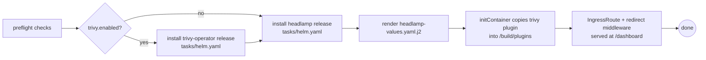

# Role: k8s-extension-headlamp

## What

Installs the Headlamp web dashboard (a GUI for the cluster) and, when enabled, the Trivy operator that scans workloads for known vulnerabilities — surfaced directly inside Headlamp via a plugin.

## Why

After provisioning there is no sensible way to inspect the cluster from a browser. Headlamp provides that UI, and the Trivy plugin means security findings are visible in the same dashboard instead of requiring separate `kubectl` invocations. Both are optional-ish: Trivy is gated by the `homelab.security.trivy.enabled` toggle in `config.yaml`.

## How (install)



Template details from `headlamp-values.yaml.j2`:

- **Dashboard rule** — served at `<domain>/dashboard` when a domain is set, otherwise `PathPrefix(/dashboard)` on the host IP. An `extraManifest` `IngressRoute` + `headlamp-redirect` middleware route `/` to `/dashboard/`.
- **Trivy plugin** — when Trivy is enabled, an init container copies the `trivy-headlamp-plugin` into the shared `pluginsDir` volume.
- **Cluster access** — Headlamp runs with a `cluster-admin` `clusterRoleBinding` (service account `headlamp-admin`), so the dashboard can render the full cluster state.
- **Trivy target** — `images` scanning in `Standalone` mode against `mirror.gcr.io/aquasec/trivy`, with CIS/NSA/PSS compliance specs scheduled, and modest resource limits suitable for the 2 GB host.

## Variables

| Variable | Default | Description |
| --- | --- | --- |
| `headlamp_helm_release` | `headlamp` @ `headlamp/headlamp` `0.45.0` (repo `kubernetes-sigs`) | Headlamp Helm release contract. |
| `trivy_helm_release` | `trivy-operator` @ `aqua/trivy-operator` `0.34.0` (repo `aqua`) | Trivy Helm release contract. |
| `homelab.security.trivy.enabled` | `true` (from `config.yaml`) | Installs Trivy and the Headlamp plugin when true. |
| `homelab.domain.*` | from env | Dashboard routing rule + HTTPS entry point. |

## Dependencies

- `tasks/preflight.yaml`, `tasks/helm.yaml` — shared libraries.
- Traefik (its `IngressRoute` CRD + entry points are used to expose the dashboard).
- A running cluster (`k8s_core`).

## Tags

- `monitor`
- `headlamp`
- `dashboard`
- `trivy`

```bash
ansible-playbook -i ansible/inventory/main.yaml ansible/homelab.yaml --tags monitor
```

## Uninstall

Uninstalls the `trivy-operator` release, then the `headlamp` release, via the shared `tasks/helm.yaml`. Note the monitoring play (`ansible/homelab.yaml`) runs regardless of `uninstall`, letting the shared Helm task decide what to remove.
