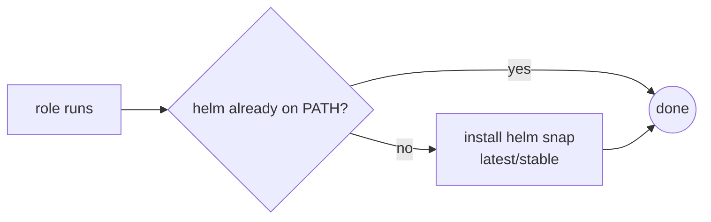

# Role: k8s_tool_helm

## What

Installs the `helm` CLI on the host via Snap (channel `latest/stable`), so Helm-based extension roles (Traefik, Headlamp, Trivy) can manage their chart releases.

## Why

All Kubernetes extensions in this homelab are installed as Helm charts. Installing Helm as its own role keeps that dependency explicit, installs it once, and lets extension roles stay thin (they delegate repo + release management to the shared `tasks/helm.yaml`).

## How



Install is skipped if `which helm` already returns something, so re-runs are no-ops.

## Variables

| Variable | Default | Description |
| --- | --- | --- |
| `helm_version` | `latest/stable` | Snap channel for Helm. Pinned comment in `vars/main.yaml` references release 4.2.4. |

## Dependencies

- None at install time. Runtime dependencies (the cluster and desired Helm repos) are provided by the `kubernetes` and extension roles.

## Tags

- `kubernetes`
- `helm`

```bash
ansible-playbook -i ansible/inventory/main.yaml ansible/homelab.yaml --tags kubernetes
```

## Uninstall

Removes the `helm` snap (`state: absent`). On full uninstall the playbook tears down the cluster and its releases before removing the CLI.
