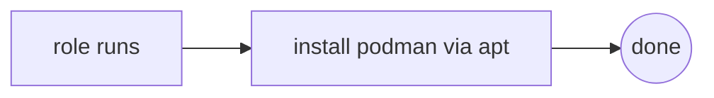

# Role: podman

## What

Installs the Podman container runtime on the host via `apt`.

## Why

Podman is the runtime behind the HAProxy reverse proxy container. It's factored as its own role because it's a host-level dependency that other roles may adopt, and keeping container-host concerns separate from the proxy logic keeps `reverse_proxy` focused on networking.

## How



It is also invoked as a nested role from `reverse_proxy`'s `setup.yaml`, so installing the reverse proxy automatically ensures Podman is present:

```yaml
- name: Install Podman
  ansible.builtin.include_role:
    name: podman
```

## Variables

None.

## Dependencies

- None at install time.
- Consumers: `reverse_proxy` (nested role include in its setup). It runs on `controllers` hosts via the `reverse_proxy` play.

## Tags

- `reverse_proxy`

```bash
ansible-playbook -i ansible/inventory/main.yaml ansible/homelab.yaml --tags reverse_proxy
```

## Uninstall

Removes the `podman` apt package (`state: absent`). Uninstall runs as part of the `reverse_proxy` teardown.
