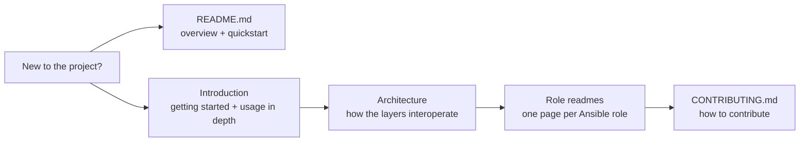

# Documentation

The documentation is organized so each document answers *what*, *why* and *how* — and uses diagrams wherever relationships matter.

## Guides

| Document | Use it when... |
| --- | --- |
| [Introduction](intro.md) | You want to install, configure or uninstall the homelab, or understand every configuration option. |
| [Architecture](architecture.md) | You want to understand how the layers interoperate, how traffic flows, or how install/uninstall works. |
| [Role readmes](#roles) | You want to understand or modify a single Ansible role. |

## Roles

Each role lives in its own directory with a self-contained `README.md`.

| Role | Responsibility |
| --- | --- |
| [base](../ansible/roles/base/README.md) | Preflight checks and host foundation (group, user, directory) |
| [k8s_core](../ansible/roles/k8s_core/README.md) | MicroK8s cluster, addons, kubeconfig, Kubectl CLI, Helm CLI via snap |
| [k8s_extension_traefik](../ansible/roles/k8s_extension_traefik/README.md) | Traefik ingress gateway and dashboard |
| [k8s_extension_headlamp](../ansible/roles/k8s_extension_headlamp/README.md) | Headlamp dashboard + Trivy vulnerability scanning |
| [podman](../ansible/roles/podman/README.md) | Podman container runtime |
| [reverse_proxy](../ansible/roles/reverse_proxy/README.md) | HAProxy reverse proxy and firewall lockdown |

## Project-level

- [CONTRIBUTING.md](../CONTRIBUTING.md) — conventions, setup and workflow for contributors
- [Examples](examples/demo.yaml) — a sample app deployment demonstrating the traffic path
