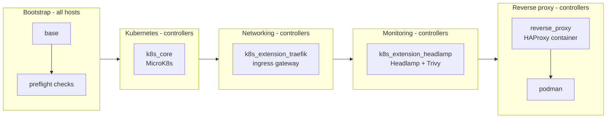
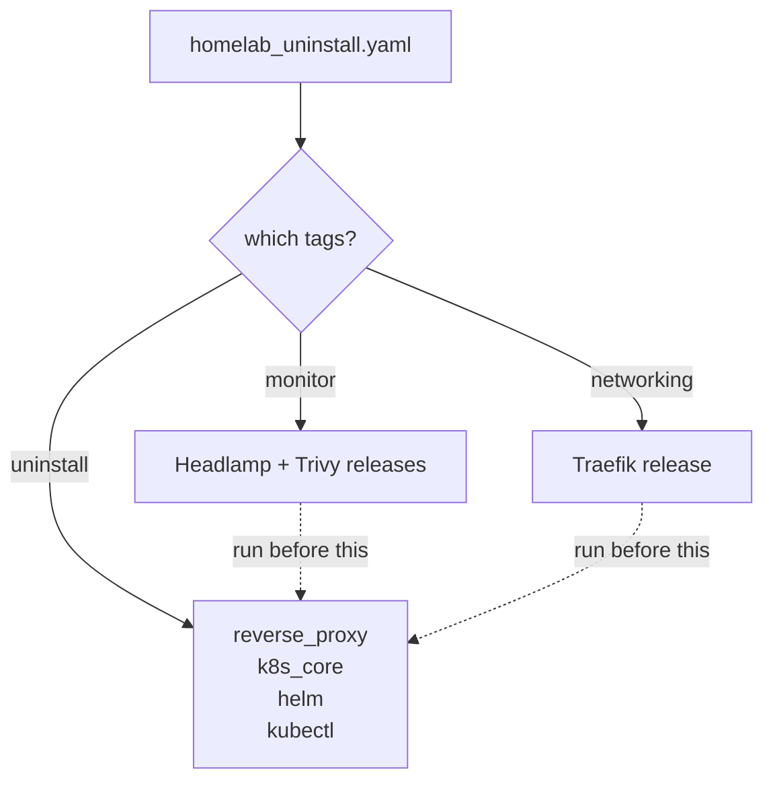
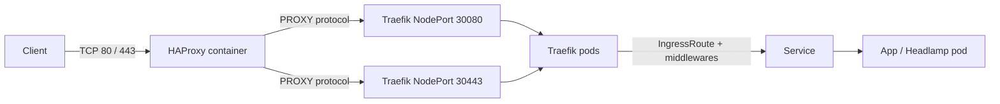
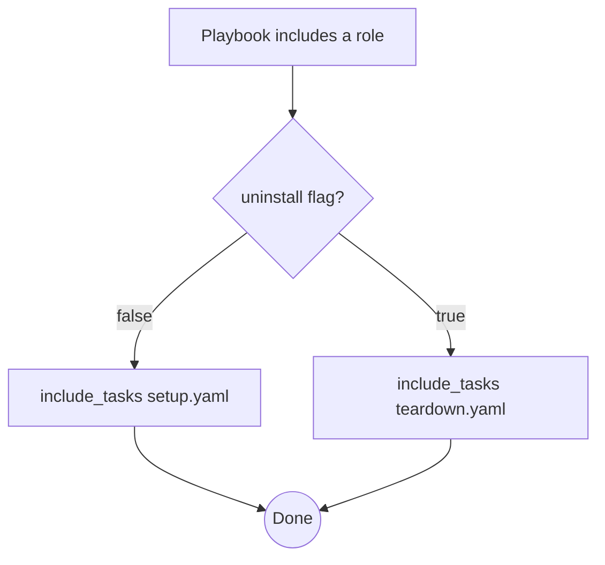
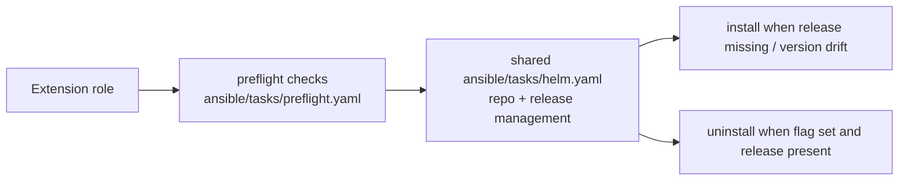
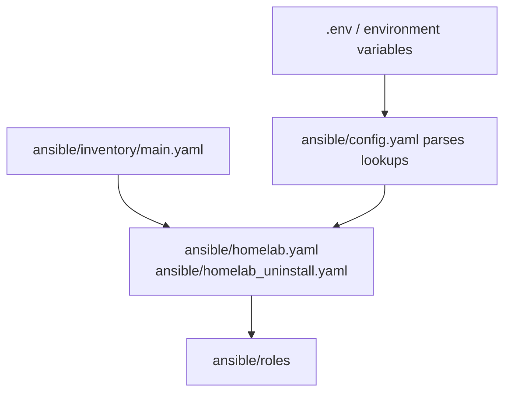

# Architecture

This page explains *how* the homelab is wired together: how the playbooks order their roles, how a request flows from the internet into a pod, and how uninstall reverses the whole thing.

## Design goals

- **One host, many layers.** Everything runs on a single Ubuntu host. Kubernetes, the ingress gateway, the dashboards and the reverse proxy are distinct layers with clearly separated responsibilities.
- **Deterministic install and uninstall.** Every role has a `setup` and a `teardown` task file, and the `uninstall` flag in `ansible/config.yaml` picks between them. No manual cleanup.
- **One playbook per direction.** `ansible/homelab.yaml` installs and `ansible/homelab_uninstall.yaml` tears down. Neither one gates the other's work on a flag, so a run executes only what you asked for instead of skipping half the tasks.
- **Central configuration.** Host identity lives in the Ansible inventory; *what* gets installed lives in `ansible/config.yaml`; *secrets* live only in environment variables.
- **Defense in depth.** The only public entry point is an HAProxy container. Kubernetes NodePorts are firewalled to loopback, and dashboards are behind basic auth.

## Playbook and role ordering

`ansible/homelab.yaml` is the install playbook, and the entry point: five plays, run in order, each tagged so you can install a single layer with `--tags`.



Key points:

- **Play 1** (`base`) runs on every host. The role has no `teardown.yaml`, so it never appears in the uninstall playbook.
- **Play 2** installs the Kubernetes tooling (kubectl, then helm) before the cluster itself (MicroK8s), because the cluster role assumes those tools exist.
- **Plays 3–5** each wrap a single extension role. The reverse proxy is deliberately installed last, after the Traefik NodePorts it proxies already exist.

`ansible/homelab_uninstall.yaml` is a single play that removes the same roles in reverse dependency order, so the reverse proxy goes first and the cluster last. The work itself is not gated on a flag: `uninstall: true` is a play var of that playbook, which is what switches each role's `tasks/main.yaml` onto its teardown path.

The expected output (install):

```bash
ansible-playbook -i ansible/inventory/main.yaml ansible/homelab.yaml
```

The expected output (uninstall):

```bash
ansible-playbook -i ansible/inventory/main.yaml ansible/homelab_uninstall.yaml --tags uninstall
```

### Which teardowns run by default

The `uninstall` tag marks the default teardown. The Helm-managed extensions deliberately do not carry it, so a plain `--tags uninstall` run leaves them alone and they are removed only when their own tag is passed:



Run the opt-in teardowns first: `helm ... uninstall` (in `ansible/tasks/helm.yaml`) talks to the cluster that the default teardown deletes.

### Two playbooks, no selector flag

Which direction you want is decided by *which playbook you run*, not by a variable: `ansible/homelab.yaml` installs, `ansible/homelab_uninstall.yaml` tears down. Inside a playbook, tags pick the layer (`--tags networking`, `--tags uninstall`, ...). Nothing reads `uninstall` to choose a playbook, so a run never loads the other direction's tasks and never prints a skipped-task line for them.

The one place the flag is still honoured is inside the roles: `homelab_uninstall.yaml` sets `uninstall: true` as a play var, which is what switches each role's `tasks/main.yaml` onto its teardown path. The same variable on `homelab.yaml` is a mistake, so its first task rejects it — tagged `always` so a tag filter cannot skip past the check:

```yaml
- name: Refuse to tear down from the install playbook
  ansible.builtin.fail:
    msg: >-
      `uninstall` is not a switch on this playbook. To remove the stack, run
      ansible-playbook -i <inventory> ansible/homelab_uninstall.yaml --tags uninstall
  when: uninstall | bool
  tags: [always]
```

Without it, `homelab.yaml -e uninstall=true` would not be a harmless no-op: every role would run its teardown in *install* order, so the cluster would be deleted before the Helm releases that need it, and the reverse proxy would be left running.

## Request flow

This is the path every HTTP request takes. HAProxy listens on the public ports `80`/`443`; everything behind it lives on loopback-only NodePorts.



- **HAProxy** (TCP mode) forwards to Traefik's NodePorts with the PROXY protocol, so Traefik sees the real client IP.
- **Traefik's `web`/`websecure` NodePorts** (`30080`/`30443`) are open only to the loopback interface and to the HAProxy system user — iptables rules in the `raw` table make direct external access impossible (`reverse_proxy` role).
- **Middlewares** applied at the ingress layer: basic auth for the dashboards, rate limiting (`rate-limit`), HTTP→HTTPS redirect, and path redirects.

## Install vs uninstall

Every role follows the same dispatch pattern in its `main.yaml`:



The flag is a play var, so the branch is picked once per playbook rather than per task — and the roles are shared by both playbooks, which is why no task needs a `when` of its own.

Helm-managed components (Traefik, Headlamp, Trivy) share `ansible/tasks/helm.yaml`, which is idempotent: it checks whether the Helm repo/release already exists and only installs or uninstalls when something needs to change.



## Shared task libraries

| File | Purpose |
| --- | --- |
| `ansible/tasks/preflight.yaml` | Assertions that run before anything mutates the host: Ubuntu OS, admin credentials present, valid domain URL, valid HTTPS email. Imported by the base role and by extension roles. |
| `ansible/tasks/helm.yaml` | Reusable Helm repository/release install and uninstall. Used by the Traefik, Headlamp and Trivy extensions. Validates a `helm_release` contract (name, namespace, chart, repo). |
| `ansible/tasks/resolve_path.yaml` | Resolves a leading `~` in `homelab.dir` to the connecting user's absolute home path before any role runs. |

## Configuration and secrets

Configuration is split by sensitivity:



- **`ansible/inventory/main.yaml`** — which hosts get which services (`controllers` group).
- **`ansible/config.yaml`** — non-secret settings (`homelab.dir`, `homelab.k8s.version`, domain, security toggles, and the `uninstall` flag that selects each role's setup or teardown path). Secret fields are `lookup`ed from the environment rather than hard-coded.
- **`.env`** — the actual secrets: `HOMELAB_ADMIN_*` (required) and `HOMELAB_DOMAIN_*`, `HOMELAB_SECURITY_TRIVY_ENABLED` (optional). Applied to the playbook session via `export`.

See [docs/intro.md](intro.md) for a full reference of every key.

## Security model

- **Single entry point.** Only HAProxy is exposed on public ports. Kubernetes NodePorts are firewalled to loopback with iptables rules persisted in `/etc/iptables` (`iptables-persistent`).
- **Owner-based forwarding.** The HAProxy container runs as its own unprivileged system user; iptables allows that user's outbound connections to the NodePorts and drops everyone else's.
- **Dashboards behind basic auth.** Traefik's dashboard and Headlamp are protected by `homelab.admin.username`/`homelab.admin.password` rendered into a Kubernetes basic-auth secret.
- **Hardened cluster defaults.** MicroK8s boots with the `cis-hardening`, `dns`, `hostpath-storage` and `rbac` addons (`hostpath-storage` on controllers only, since a single node must own the hostpath provisioner); Trivy scans workloads for vulnerabilities when enabled.
- **Optional HTTPS.** With a domain and ACME email set, Traefik issues Let's Encrypt certificates and HTTP traffic redirects to HTTPS.
- **No secrets in code.** Credentials are injected from environment variables and never committed.

## Role index

| Role | Readme |
| --- | --- |
| base (foundation) | [roles/base/README.md](../ansible/roles/base/README.md) |
| k8s_core (MicroK8s) | [roles/k8s_core/README.md](../ansible/roles/k8s_core/README.md) |
| k8s_extension_traefik (ingress) | [roles/k8s_extension_traefik/README.md](../ansible/roles/k8s_extension_traefik/README.md) |
| k8s_extension_headlamp (dashboard + Trivy) | [roles/k8s_extension_headlamp/README.md](../ansible/roles/k8s_extension_headlamp/README.md) |
| podman (container runtime) | [roles/podman/README.md](../ansible/roles/podman/README.md) |
| reverse_proxy (HAProxy) | [roles/reverse_proxy/README.md](../ansible/roles/reverse_proxy/README.md) |

## Next steps

- [docs/intro.md](intro.md) — from zero to a running homelab
- [README.md](../README.md) — quickstart overview
