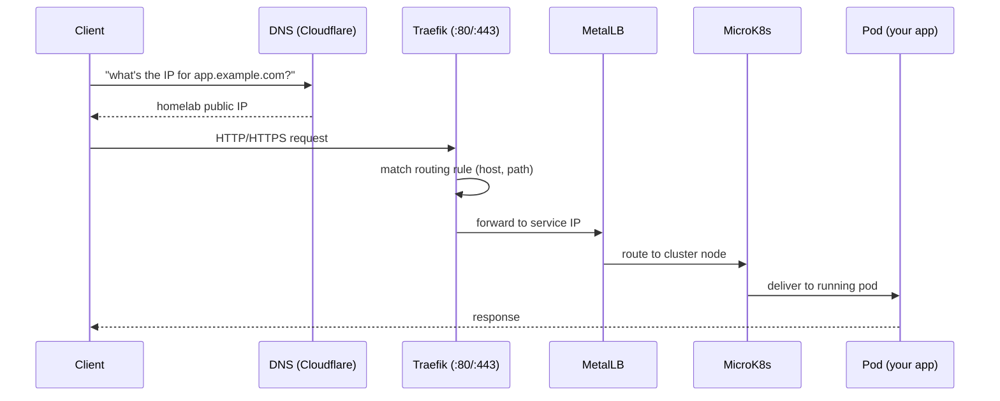
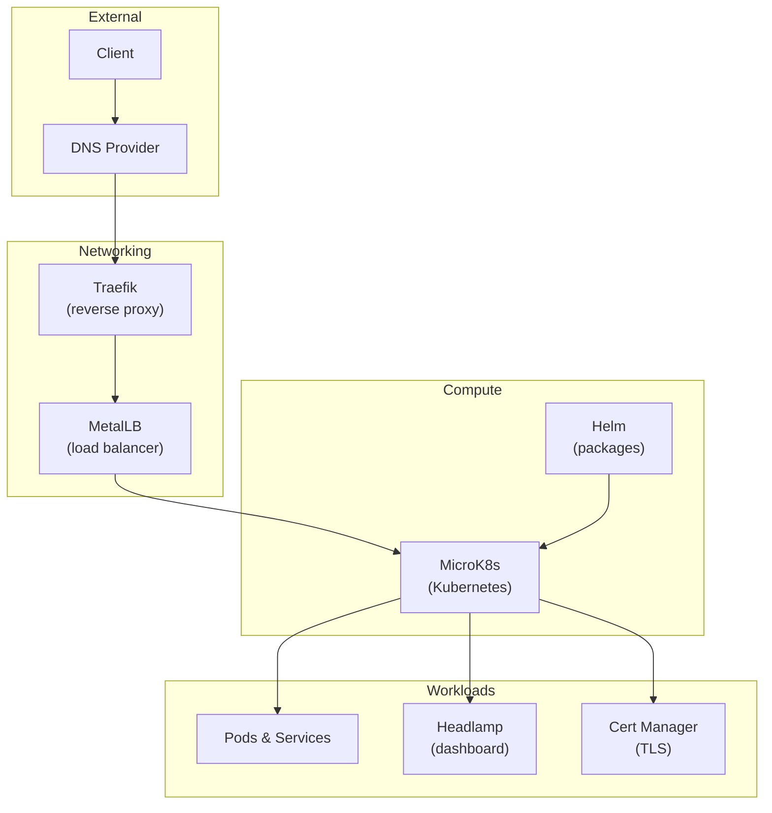
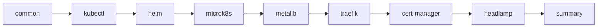

# Architecture

The homelab is a self-hosted Kubernetes cluster that runs on a single machine (typically a Raspberry Pi). This document explains how the components connect and what role each plays.

## Request Flow

When a client (browser, CLI, API) makes a request to a service hosted on the homelab, it passes through several layers before reaching the application:

## Component Layers

The homelab is organized into four layers:

### 1. Compute — Kubernetes (MicroK8s)

The foundation of the homelab is a [MicroK8s](https://canonical.com/microk8s) cluster. Kubernetes is a container orchestration platform — it schedules, runs, and manages containers (pods) across nodes. MicroK8s is a lightweight distribution designed for edge devices.

See [Container Orchestration](container-orchestration.md) for more.

### 2. Package Management — Helm

[Helm](https://helm.sh) is the package manager for Kubernetes. It is used to install and manage cluster extensions (MetalLB, Traefik, Cert Manager, Headlamp) as "charts" — reusable, configurable packages.

### 3. Load Balancing — MetalLB

In a cloud environment, load balancers are provisioned automatically with public IPs. On a self-hosted cluster, there is no cloud provider to hand you IPs. [MetalLB](https://metallb.universe.tf) fills this gap by assigning IP addresses from a pool you define to services exposed via `LoadBalancer` type.

See [Load Balancing](load-balancing.md) for more.

### 4. Ingress / Reverse Proxy — Traefik

[Traefik](https://traefik.io) sits at the edge of the cluster and routes incoming HTTP/HTTPS requests to the correct service based on hostnames, paths, and other rules. It replaces the default Kubernetes ingress controller to avoid port conflicts on the host.

See [Reverse Proxy](reverse-proxy.md) for more.

### 5. TLS — Cert Manager

[Cert Manager](https://cert-manager.io) automates TLS certificate issuance and renewal using Let's Encrypt. When Traefik is configured with a domain, Cert Manager provisions certificates so your services are accessible over HTTPS.

### 6. Dashboard — Headlamp

[Headlamp](https://headlamp.dev) provides a web-based UI for inspecting and managing the Kubernetes cluster — pods, services, deployments, logs, and more.

## Ansible Roles and the Stack

The Ansible playbook (`playbooks/homelab.yaml`) installs these components in order, each as a role:

| Role | What it installs |
|---|---|
| `common` | Shared setup across all nodes (groups, directories) |
| `k8s-base-kubectl` | [kubectl](https://kubernetes.io/docs/tasks/tools/#kubectl) — the Kubernetes CLI |
| `k8s-base-helm` | [Helm](https://helm.sh) — package manager |
| `k8s-base-microk8s` | [MicroK8s](https://canonical.com/microk8s) — the cluster |
| `k8s-extension-metallb` | [MetalLB](https://metallb.universe.tf) — load balancing |
| `k8s-extension-traefik` | [Traefik](https://traefik.io) — ingress / reverse proxy |
| `k8s-extension-cert-manager` | [Cert Manager](https://cert-manager.io) — TLS certificates |
| `k8s-extension-headlamp` | [Headlamp](https://headlamp.dev) — cluster dashboard |
| `summary` | Prints access information to the console |
