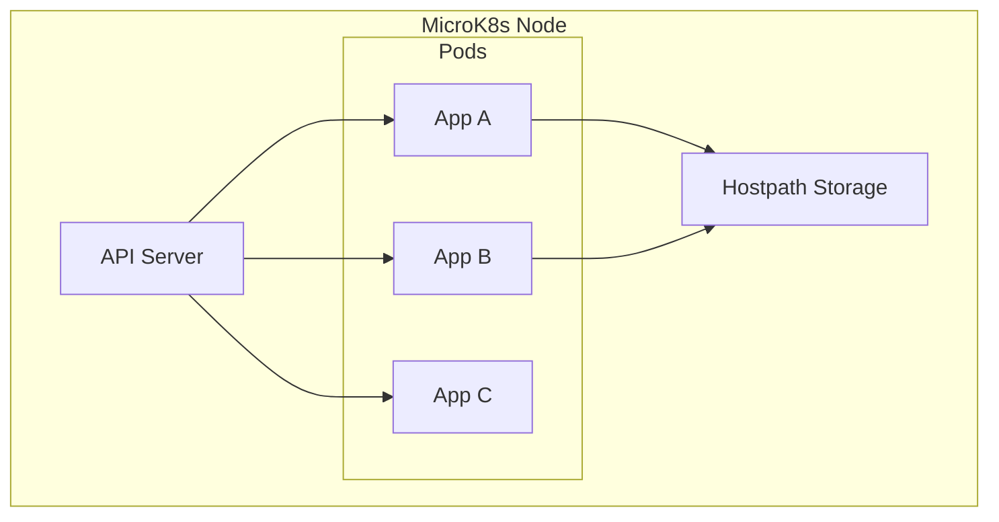

# Container Orchestration

Container orchestration is the automated management of containers — scheduling them across machines, restarting failed ones, scaling up and down, and networking them together. At its core, it answers the question: *given a set of application containers, how do we run and connect them reliably?*

## Why Kubernetes

[Kubernetes](https://kubernetes.io) (k8s) is the industry-standard orchestrator. It provides:

- **Scheduling** — decides which node runs each container
- **Self-healing** — restarts crashed containers, replaces failed nodes
- **Service discovery** — containers find each other by name, not IP
- **Scaling** — add or remove replicas based on demand
- **Rolling updates** — deploy new versions without downtime

## Why MicroK8s

There are many Kubernetes distributions. The homelab uses [MicroK8s](https://canonical.com/microk8s) because it:

- runs on a **single node** (ideal for a Raspberry Pi)
- installs with one command and a small resource footprint
- includes built-in **add-ons** (DNS, storage, Helm) that can be toggled on/off
- is maintained by Canonical (the Ubuntu team), so it integrates well with Ubuntu-based hosts

## How It Fits in the Homelab

The MicroK8s cluster is the compute layer — it runs your applications as pods. Everything else (load balancing, ingress, TLS) layers on top.

In this homelab, the cluster is a **single-node** setup: one machine runs both the control plane and your workloads.

## Learn More

- [Kubernetes documentation](https://kubernetes.io/docs/home/)
- [MicroK8s documentation](https://canonical.com/microk8s/docs)
- [MicroK8s add-ons](https://canonical.com/microk8s/docs/addons)
