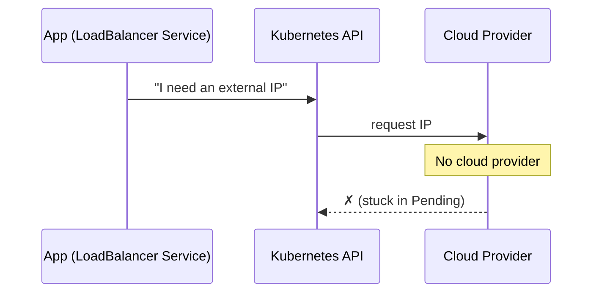
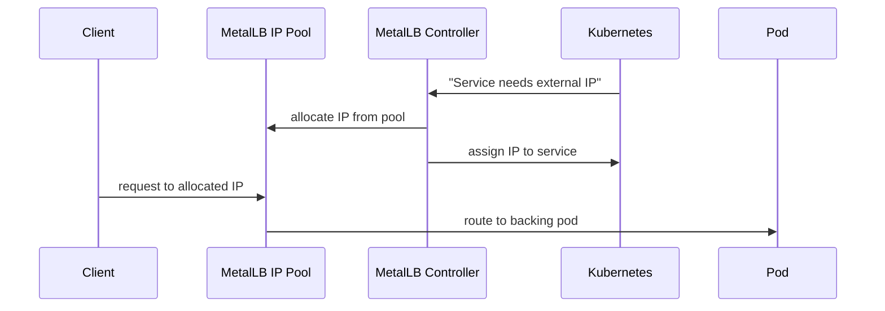
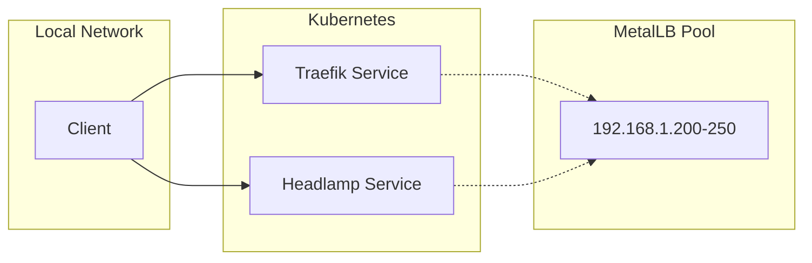

# Load Balancing

A load balancer distributes incoming network traffic across multiple targets. In cloud environments, this is handled automatically — you request a load balancer, the cloud provider assigns it a public IP, and traffic flows. On a self-hosted cluster, there is no cloud provider to do this for you.

## The Problem

Kubernetes services of type `LoadBalancer` are designed to request an external IP from a cloud provider. On bare metal, this request goes unanswered — the service gets stuck in `Pending` state because no one assigns it an IP.



## The Solution: MetalLB

[MetalLB](https://metallb.universe.tf) is a load balancer implementation for bare-metal Kubernetes clusters. It gives you what cloud providers normally provide: a pool of IP addresses that can be assigned to services.



## How It Works

1. You define a pool of IP addresses in your `vars/main.yaml`:

   ```yaml
   metallb_ip_pool: 192.168.1.200-192.168.1.250
   ```

2. MetalLB watches for `LoadBalancer` services and assigns them an IP from this pool.
3. Clients on your local network can then reach the service at that IP.

## In the Homelab

MetalLB sits between Kubernetes and the external network. When Traefik (the reverse proxy) or Headlamp (the dashboard) are installed as `LoadBalancer` services, MetalLB assigns them IPs on your LAN — making them reachable from any device on the network.



## Learn More

- [MetalLB documentation](https://metallb.universe.tf/configuration/)
- [MicroK8s MetalLB add-on](https://canonical.com/microk8s/docs/addon-metallb)
- [Kubernetes Service types](https://kubernetes.io/docs/concepts/services-networking/service/#loadbalancer)
