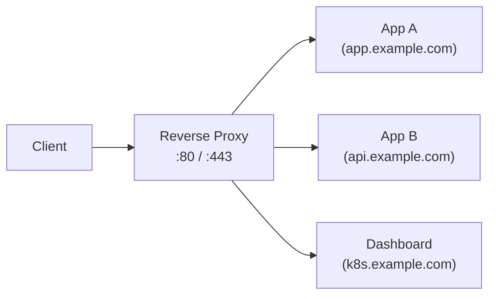
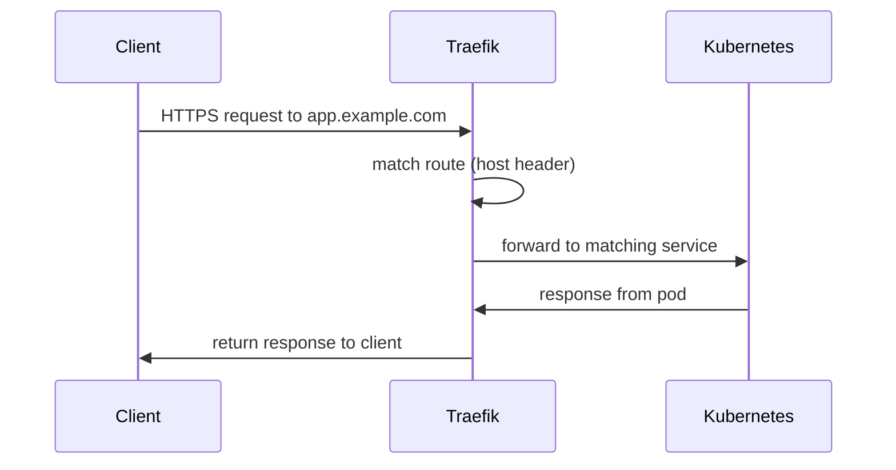

# Reverse Proxy

A reverse proxy sits between clients and backend services, forwarding requests to the appropriate destination and returning the response. Unlike a forward proxy (which sits in front of clients), a reverse proxy sits in front of servers.

## Why You Need One

The homelab runs multiple services — Kubernetes apps, a dashboard, potentially a private registry — that all need to share the same ports (80 for HTTP, 443 for HTTPS). A reverse proxy inspects incoming requests and routes them to the correct service based on the hostname or path.



Without a reverse proxy, each service would need its own port, and clients would have to remember port numbers alongside hostnames.

## Why Traefik

There are many reverse proxies (nginx, Caddy, HAProxy). The homelab uses [Traefik](https://traefik.io) because it:

- **integrates natively with Kubernetes** — discovers services automatically via the Kubernetes API
- **supports automatic TLS** — integrates with Let's Encrypt via Cert Manager
- **avoids port conflicts** — the default Kubernetes ingress controller "hijacks" ports 80/443 on the host, which can conflict with other services. Traefik can be configured to listen on different ports or run as a `LoadBalancer` service via MetalLB, sidestepping this problem entirely

## How It Works in the Homelab

When a client sends a request (e.g. `https://app.example.com`):



1. Traefik receives the request on port 443.
2. It matches the `Host` header against its routing rules.
3. It forwards the request to the correct Kubernetes service.
4. The response travels back through Traefik to the client.

## Two Modes

### Local access (default)

Without a domain, Traefik is accessible at `http://traefik.local`. You need a local DNS resolver or a hosts file entry pointing `traefik.local` to your cluster node's IP.

### Domain access with TLS

Set `traefik_domain` and `traefik_acme_email` in `vars/main.yaml`:

```yaml
traefik_domain: homelab.example.com
traefik_acme_email: you@example.com
```

This enables:
- Automatic TLS certificate issuance via Let's Encrypt
- HTTP → HTTPS redirect
- HTTPS access at your domain (e.g. `https://app.homelab.example.com`)

## Learn More

- [Traefik Kubernetes documentation](https://doc.traefik.io/traefik/getting-started/kubernetes/)
- [Traefik routing concepts](https://doc.traefik.io/traefik/routing/services/)
- [Kubernetes Ingress](https://kubernetes.io/docs/concepts/services-networking/ingress/)
