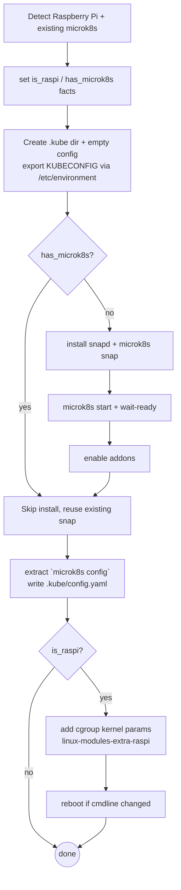

# Role: k8s-core

## What

Installs and configures the Kubernetes cluster — MicroK8s via Snap — enables its hardened addons, writes a KubeConfig the operator (and future roles) can use, and applies the kernel settings Raspberry Pi hosts need.

## Why

MicroK8s is the cluster substrate everything else runs on: Traefik, Headlamp, Trivy and user apps are all deployed into it. This role makes the cluster repeatable (snap channel locked to `homelab.k8s.version`) and secure (CIS hardening + RBAC addons on by default).

## How



Environments it handles specially:

- **Existing MicroK8s** — if the snap is already installed, install steps are skipped; the KubeConfig is still (re)written from the running cluster.
- **Raspberry Pi** — installs `linux-modules-extra-raspi` (Ubuntu < 24.04) and appends `cgroup_enable=memory cgroup_memory=1` to the boot cmdline (`/boot/firmware/cmdline.txt` / `nobtcmd.txt`), rebooting once if the parameters changed. See the [MicroK8s Raspberry Pi guide](https://canonical.com/microk8s/docs/install-raspberry-pi).

## Variables

| Variable | Default | Description |
| --- | --- | --- |
| `addons` | `cis-hardening`, `dns`, `hostpath-storage`, `rbac` | MicroK8s addons enabled on first install. |
| `homelab.k8s.version` | `1.36` (from `config.yaml`) | Snap channel for MicroK8s. |
| `homelab.dir` | `~/homelab` (from `config.yaml`) | Parent of `~/.kube`. |

## Dependencies

- `k8s-tool-kubectl` / `k8s-tool-helm` — installed first in the `kubernetes` play so the KubeConfig and tooling exist together.
- Requires `snapd` (installed by the role when missing).

## Tags

- `kubernetes`

```bash
ansible-playbook -i inventory/main.yaml playbooks/homelab.yaml --tags kubernetes
```

## Uninstall

Removes the `microk8s` snap and deletes the KubeConfig file (`{{ homelab.dir }}/.kube/config.yaml`). In the playbook this runs before the CLI tooling is removed, so the cluster is always uninstalled cleanly.