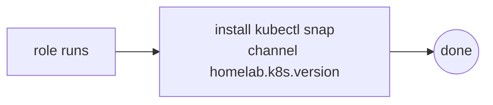

# Role: k8s-tool-kubectl

## What

Installs the `kubectl` CLI on the host via Snap, pinned to the Kubernetes version configured in `config.yaml` (`homelab.k8s.version`).

## Why

`kubectl` is the operator's interface to the MicroK8s cluster. Installing it as a role (rather than assuming it on the host) keeps the provisioning deterministic and version-locked to the cluster's Kubernetes release.

## How

The role manages a single Snap package:



- Install uses the `community.general.snap` module with `classic: true`.
- The channel tracks `homelab.k8s.version` (default `1.36`), so tooling is always aligned with the cluster version.

## Variables

| Variable | Source | Description |
| --- | --- | --- |
| `homelab.k8s.version` | `config.yaml` (default `1.36`) | Snap channel / Kubernetes version for kubectl. |

## Dependencies

- Requires a running Kubernetes cluster role in the same play (installed via the `kubernetes` play in `playbooks/homelab.yaml`).

## Tags

- `kubernetes`
- `kubectl`

```bash
ansible-playbook -i inventory/main.yaml playbooks/homelab.yaml --tags kubernetes
```

## Uninstall

Removes the `kubectl` snap (`state: absent`). On full uninstall the playbook tears down the cluster before removing the tooling.