# Role: reverse-proxy

## What

Runs a TCP-mode HAProxy container (via Podman, host networking) on ports `80`/`443` and locks the Kubernetes ingress NodePorts (`30080`/`30443`) down to that proxy with iptables. HAProxy forwards every connection to Traefik using the PROXY protocol.

## Why

The cluster's Traefik entry points are exposed on NodePorts. Left alone, those ports are open to the whole network — or worse, double-proxied badly. This role makes HAProxy the **only** public ingress and guarantees three things at the firewall level:

1. NodePorts are reachable **only from the loopback interface** (external packets dropped in the `raw`/PREROUTING table).
2. Only the **HAProxy system user** may connect outbound to those NodePorts (owner-matched allow in OUTPUT).
3. Every other user's outbound connection to the NodePorts is dropped.

Together these mean the only practical path to the cluster's ingress traffic is through the reverse proxy itself.

## How (install)

```mermaid
flowchart LR
    pre[preflight checks] --> podman[install podman role]
    podman --> dir[create haproxy dir<br/>homelab.dir/haproxy]
    dir --> cfg[template haproxy.cfg.j2]
    cfg --> user[create unprivileged haproxy system user]
    user --> run[run HAProxy container<br/>host network, uid, NET_BIND_SERVICE<br/>restart unless-stopped]
    run --> rules[compose node port list<br/>30080 / 30443 x ipv4, ipv6]
    rules --> fw[iptables lockdown]

    subgraph fw[Firewall: raw table]
        loop[PREROUTING: allow loopback,<br/>drop everything else on node ports]
        out[OUTPUT: accept only haproxy uid,<br/>drop all other egress to node ports]
    end

    fw --> persist[persist rules to<br/>/etc/iptables/rules.v4 / .v6]
    persist --> done((done))
```



What HAProxy does with traffic (`haproxy.cfg.j2`):

- **`frontend http`** (port 80) → backend `traefik_http` → `127.0.0.1:30080`
- **`frontend https`** (port 443) → backend `traefik_https` → `127.0.0.1:30443`

Both backends send the PROXY protocol (`send-proxy`), health-check Traefik every 5 s, and fall back after 3 failed checks — so Traefik sees the real client IP and HAProxy won't route to a dead ingress.

## Variables

| Variable | Default | Description |
| --- | --- | --- |
| `reverse_proxy.dir` | `{{ homelab.dir }}/haproxy` | HAProxy config directory on the host. |
| `reverse_proxy.container.name` | `reverse-proxy` | Container name (host network, `NET_BIND_SERVICE` capability to bind 80/443). |
| `reverse_proxy.container.image` | `docker.io/haproxy:3.4.4-alpine@sha256:...` | Pinned HAProxy image. |
| `reverse_proxy.container.user` | `haproxy` | Unprivileged system user the container runs as and that iptables trusts. |
| `reverse_proxy.http.listen_port` / `node_port` | `80` / `30080` | Public and Traefik HTTP ports. |
| `reverse_proxy.https.listen_port` / `node_port` | `443` / `30443` | Public and Traefik HTTPS ports. |
| `reverse_proxy.firewall.loopback` | ipv4 `127.0.0.1/32`, ipv6 `::1/128` | Sources allowed to reach the NodePorts. |

## Dependencies

- `podman` role — included from `setup.yaml`; provides the container runtime.
- `k8s-extension-traefik` — the NodePorts (`30080`/`30443`) and their PROXY protocol config must exist first; that's why this play runs last.
- `iptables-persistent` — installed by the role so rules survive reboots.

## Tags

- `reverse-proxy`

```bash
ansible-playbook -i inventory/main.yaml playbooks/homelab.yaml --tags reverse-proxy
```

## Uninstall

Reverses everything:

1. Stops and removes the HAProxy container.
2. Removes the HAProxy config directory.
3. Removes the iptables owner-rule, source-allow and drop rules (both IPv4 and IPv6), persisting the cleared state.
4. Removes the `haproxy` system user.

The `podman` apt package is removed by the `podman` role's teardown in the same play. Because external access checks are now gone too, uninstall Traefik only after fully removing this layer.